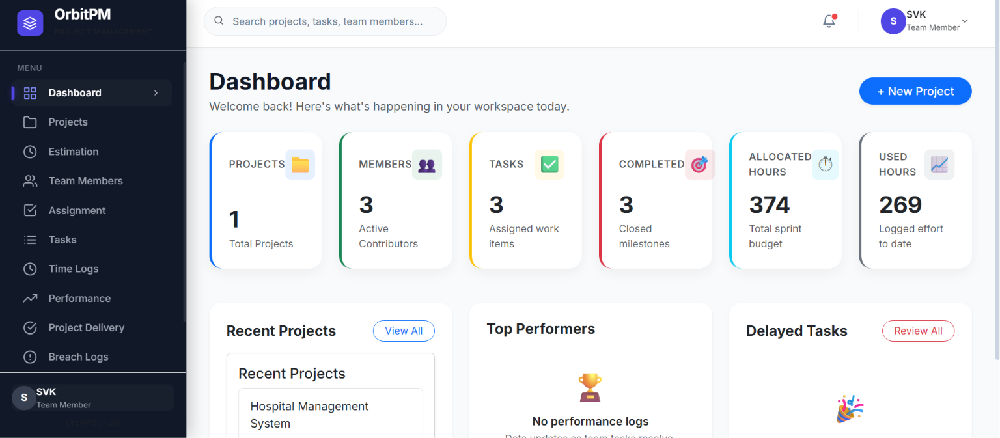
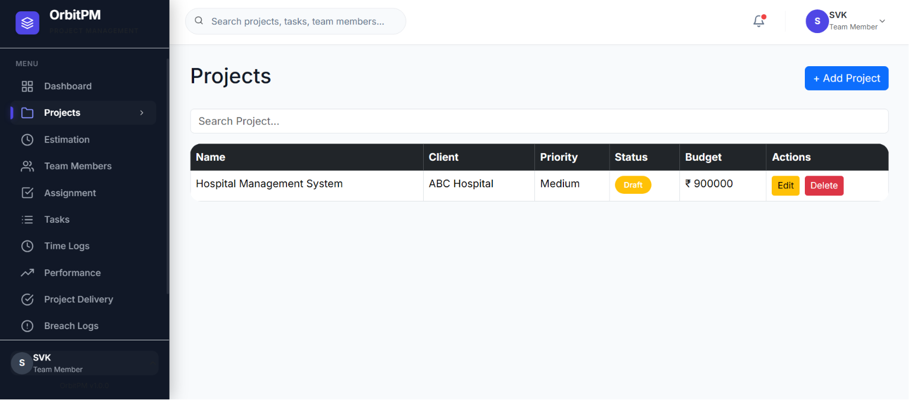
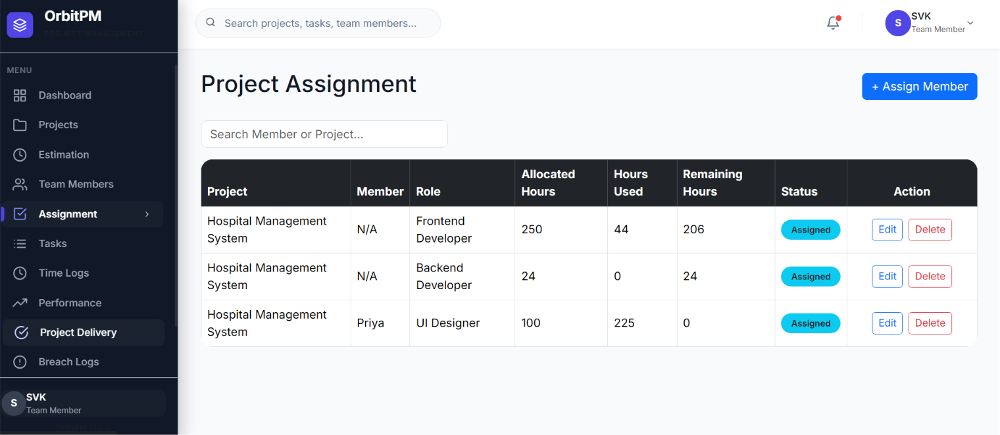
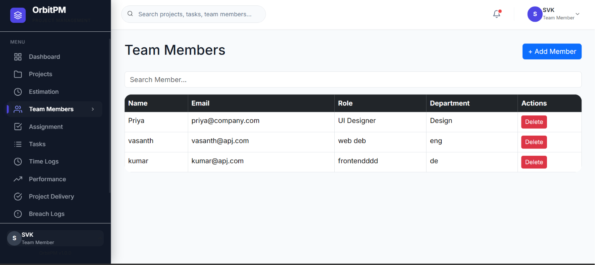
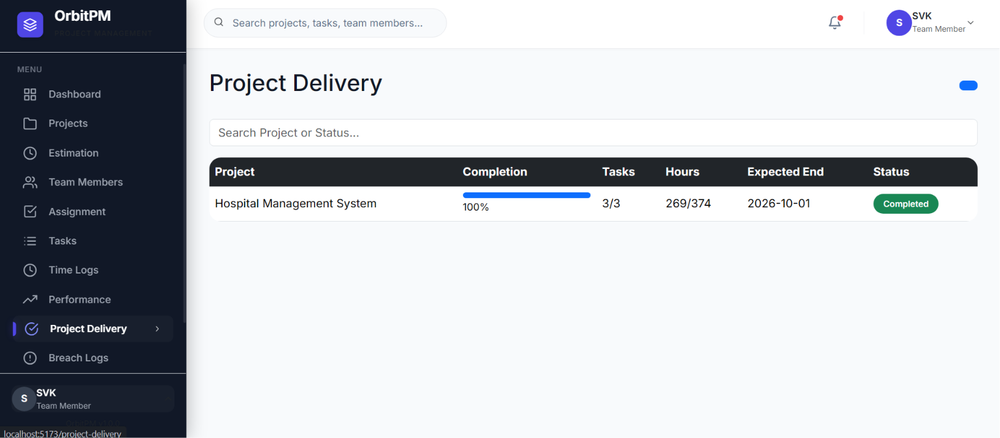
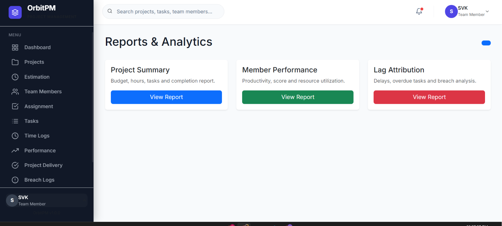

<div align="center">
  

  <h1>📊 Organizational Project Management System</h1>

  <p>
    A full-stack organizational project management platform for managing projects, estimations, assignments, tasks, time logs, performance tracking, delivery status, and analytical reports.
  </p>

  <p>
    <a href="https://github.com/svk-vasanthkumar/Organizational-Project-Management/stargazers">
      
    </a>
    <a href="https://github.com/svk-vasanthkumar/Organizational-Project-Management/network/members">
      
    </a>
    <a href="https://github.com/svk-vasanthkumar/Organizational-Project-Management/issues">
      
    </a>
    <a href="backend/package.json">
      
    </a>
  </p>
</div>

---

## 📚 Table of Contents

- [Overview](#-overview)
- [Why This Project?](#-why-this-project)
- [Key Features](#-key-features)
- [System Workflow](#-system-workflow)
- [Screenshots](#-screenshots)
- [Technology Stack](#-technology-stack)
- [Folder Structure](#-folder-structure)
- [Database Collections / Schema Summary](#-database-collections--schema-summary)
- [Application Architecture](#-application-architecture)
- [Authentication Flow](#-authentication-flow)
- [Performance Formula Explanation](#-performance-formula-explanation)
- [Installation Guide](#-installation-guide)
- [Environment Variables](#-environment-variables)
- [Running the Project](#-running-the-project)
- [API Overview](#-api-overview)
- [Validation Rules](#-validation-rules)
- [Security Features](#-security-features)
- [Reports & Analytics](#-reports--analytics)
- [Future Enhancements](#-future-enhancements)
- [Author](#-author)
- [License](#-license)
- [Support / Star Repository](#-support--star-repository)

---

## 🔎 Overview

**Organizational Project Management System** is a MERN-based web application designed to support project planning, team allocation, task execution, time tracking, performance monitoring, delivery review, and reporting from one centralized dashboard.

The application includes a React frontend with protected pages and an Express.js backend connected to MongoDB through Mongoose. JWT authentication is used for secured API access, and the frontend consumes backend services through Axios.

---

## 🎯 Why This Project?

Organizations often need a clear view of project budgets, estimated hours, assigned team members, task progress, delivery status, and delays. This project brings those operational workflows into a single system so teams can:

| Need | How the System Helps |
| --- | --- |
| Project visibility | Tracks projects, status, budget, hours, and recent activity |
| Work allocation | Assigns members to projects with hour limits |
| Task control | Connects tasks to project assignments and monitors progress |
| Time tracking | Logs work hours against tasks and updates used hours |
| Performance review | Calculates score, completion percentage, and delay impact |
| Reporting | Provides project summary, member performance, and lag attribution reports |

---

## ✨ Key Features

| Module | Available Capabilities |
| --- | --- |
| 🔐 Authentication | Register, login, JWT token generation, protected frontend routes |
| 📊 Dashboard | Project, member, task, completed task, active project, allocated hour, and used hour statistics |
| 📁 Project Management | Create, view, update, delete, and track projects |
| 💰 Estimation | Create estimations, update estimations, approve estimations, reject estimations |
| 👥 Team Members | Add, view, and delete team members |
| 🧩 Project Assignment | Assign members to projects, allocate hours, prevent duplicate assignments |
| ✅ Task Management | Create, view, update, delete, prioritize, and track task progress |
| ⏱️ Time Logging | Log task hours, update task logged hours, update assignment hours used |
| 📈 Performance Tracker | View member score, task completion, used hours, remaining hours, and breach count |
| 📦 Project Delivery | View project delivery dashboard data |
| 🚨 Breach Logs | View automatically recorded task deadline breaches |
| 📸 Closure Snapshots | View project closure snapshot records |
| 📄 Reports & Analytics | Project summary, member performance, lag attribution, PDF export, CSV export |
| 👤 Profile | View profile, update profile, and change password |
| ⚙️ Settings | Frontend settings page |

---

## 🔄 System Workflow

```text
User Registration
        ↓
User Login
        ↓
JWT Stored on Client
        ↓
Create Project
        ↓
Create / Review Estimation
        ↓
Assign Team Members
        ↓
Create Project Tasks
        ↓
Log Working Hours
        ↓
Track Progress and Breaches
        ↓
Review Performance
        ↓
Project Delivery / Closure Snapshot
        ↓
Reports and Analytics
```

---

## 🖼️ Screenshots

> Screenshots are stored in the `Screenshots` folder.

| Dashboard | Projects |
| --- | --- |
|  |  |

| Assignment | Team Members |
| --- | --- |
|  |  |

| Project Delivery | Reports |
| --- | --- |
|  |  |

---

## 🛠️ Technology Stack

### Frontend


### Backend


### Database


### Export and UI Utilities


---

## 📂 Folder Structure

```text
Organizational Project Management/
├── backend/
│   ├── config/
│   │   └── database.js
│   ├── controllers/
│   ├── middleware/
│   │   └── authMiddleware.js
│   ├── models/
│   ├── routes/
│   ├── validations/
│   ├── app.js
│   ├── server.js
│   └── package.json
├── frontend/
│   ├── public/
│   ├── src/
│   │   ├── api/
│   │   ├── assets/
│   │   ├── components/
│   │   ├── layouts/
│   │   ├── pages/
│   │   ├── styles/
│   │   ├── App.jsx
│   │   └── main.jsx
│   ├── index.html
│   ├── vite.config.js
│   └── package.json
├── Screenshots/
├── docs/
├── package.json
└── README.md
```

---

## 🗄️ Database Collections / Schema Summary

| Collection | Main Fields | Purpose |
| --- | --- | --- |
| `users` | `name`, `email`, `password`, `role` | Stores registered users and authentication roles |
| `projects` | `projectId`, `name`, `client`, `type`, `priority`, `scope`, `totalHours`, `budget`, `startDate`, `endDate`, `status` | Stores project planning and budget details |
| `estimations` | `projectId`, `estimatedHours`, `hourlyRate`, `quotedPrice`, `approvalStatus` | Stores project estimation and approval state |
| `teammembers` | `name`, `email`, `role`, `department`, `status` | Stores team member profiles |
| `projectassignments` | `projectId`, `memberId`, `role`, `allocatedHours`, `hoursUsed`, `status`, `startDate` | Maps team members to projects |
| `tasks` | `projectId`, `assignmentId`, `assignedTo`, `title`, `description`, `estimatedHours`, `loggedHours`, `progress`, `deadline`, `priority`, `status`, `completedAt` | Stores assigned project tasks |
| `timelogs` | `taskId`, `memberId`, `date`, `hoursLogged`, `notes` | Records work hours against tasks |
| `performancerecords` | `memberId`, `projectId`, `score`, `statusTag` | Stores performance score records |
| `projectdeliveries` | `projectId`, `deliveryDate`, `mode`, `clientSignoff`, `notes`, `status` | Stores delivery review information |
| `breachlogs` | `taskId`, `memberId`, `originalDeadline`, `revisedDeadline`, `reason` | Tracks task deadline breaches |
| `closuresnapshots` | `projectId`, `totalBudget`, `estimatedHours`, `usedHours`, `completedTasks`, `totalTasks`, `remarks` | Stores project closure summaries |

---

## 🏗️ Application Architecture

```text
React + Vite Frontend
        ↓
Axios API Layer
        ↓
Express.js Routes
        ↓
Controllers
        ↓
Mongoose Models
        ↓
MongoDB Database
```

| Layer | Responsibility |
| --- | --- |
| Frontend pages | Screens for dashboard, projects, estimation, members, assignments, tasks, reports, profile, and settings |
| Components | Reusable UI such as modals, tables, cards, navbar, sidebar, loaders, and protected routes |
| API layer | Axios service modules for backend endpoints |
| Routes | Express route definitions under `/api` |
| Controllers | Request handling, business logic, validation checks, and response formatting |
| Models | Mongoose schemas and collection relationships |
| Middleware | JWT token verification for protected backend routes |

---

## 🔐 Authentication Flow

```text
Register or Login
        ↓
Backend validates user credentials
        ↓
Password is hashed / compared with bcryptjs
        ↓
JWT is generated on successful login
        ↓
Frontend stores token and user data in localStorage
        ↓
Axios attaches token as Authorization: Bearer <token>
        ↓
Protected backend routes verify token using JWT middleware
        ↓
Invalid or expired tokens redirect the user to login
```

| Area | Current Implementation |
| --- | --- |
| Registration | `POST /api/auth/register` |
| Login | `POST /api/auth/login` |
| Token expiry | `1d` |
| Password hashing | `bcryptjs` with salt rounds set to `10` |
| Protected frontend pages | `ProtectedRoute` checks `token` and `user` in `localStorage` |
| Protected API routes | Most project, assignment, task, time log, report, profile, performance, breach, delivery, and closure routes use `authMiddleware` |

---

## 📈 Performance Formula Explanation

The performance module calculates a member-level score using assignments, tasks, and breach logs.

```text
score = 100 - (breaches × 10) - (incompleteTasks × 5) + (completedTasks × 2)
```

The calculated score is clamped between `0` and `100`.

| Score Range | Status |
| --- | --- |
| `90 - 100` | Excellent |
| `70 - 89` | Good |
| `50 - 69` | Average |
| `0 - 49` | Critical |

Additional displayed metrics include:

- Allocated hours
- Used hours
- Remaining hours
- Total tasks
- Completed tasks
- Completion percentage
- Breach count

---

## ⚙️ Installation Guide

### 1. Clone the Repository

```bash
git clone https://github.com/svk-vasanthkumar/Organizational-Project-Management.git
cd Organizational-Project-Management
```

### 2. Install Backend Dependencies

```bash
cd backend
npm install
```

### 3. Install Frontend Dependencies

```bash
cd ../frontend
npm install
```

---

## 🔑 Environment Variables

Create a `.env` file inside the `backend` folder.

```env
PORT=5000
MONGO_URI=your_mongodb_connection_string
JWT_SECRET=your_jwt_secret_key
```

| Variable | Required | Description |
| --- | --- | --- |
| `PORT` | No | Backend server port. Defaults to `5000` when not provided |
| `MONGO_URI` | Yes | MongoDB connection string used by Mongoose |
| `JWT_SECRET` | Yes | Secret key used to sign and verify JWT tokens |

---

## 🚀 Running the Project

### Start Backend Server

```bash
cd backend
npm run dev
```

Backend runs at:

```text
http://localhost:5000
```

### Start Frontend Development Server

```bash
cd frontend
npm run dev
```

The Vite development server will display the local frontend URL in the terminal.

### Production Build

```bash
cd frontend
npm run build
```

---

## 🌐 API Overview

Base URL:

```text
http://localhost:5000/api
```

| Module | Method and Endpoint | Protection | Purpose |
| --- | --- | --- | --- |
| Auth | `POST /auth/register` | Public | Register a user |
| Auth | `POST /auth/login` | Public | Login and receive JWT |
| Auth | `GET /auth/test` | Public | Test auth route |
| Dashboard | `GET /dashboard` | Public in current backend | Fetch dashboard statistics |
| Projects | `POST /projects` | JWT | Create project |
| Projects | `GET /projects` | JWT | Get all projects |
| Projects | `GET /projects/:id` | JWT | Get project by ID |
| Projects | `PUT /projects/:id` | JWT | Update project |
| Projects | `DELETE /projects/:id` | JWT | Delete project |
| Estimations | `POST /estimations` | Public in current backend | Create estimation |
| Estimations | `GET /estimations` | Public in current backend | Get estimations |
| Estimations | `PUT /estimations/:id` | Public in current backend | Update estimation |
| Estimations | `DELETE /estimations/:id` | Public in current backend | Delete estimation |
| Estimations | `PUT /estimations/:id/approve` | Public in current backend | Approve estimation |
| Estimations | `PUT /estimations/:id/reject` | Public in current backend | Reject estimation |
| Team Members | `POST /team-members` | JWT | Add team member |
| Team Members | `GET /team-members` | JWT | Get team members |
| Team Members | `DELETE /team-members/:id` | JWT | Delete team member |
| Assignments | `POST /assignments` | JWT | Create assignment |
| Assignments | `GET /assignments` | JWT | Get assignments |
| Assignments | `GET /assignments/project/:projectId` | JWT | Get assignments by project |
| Assignments | `PUT /assignments/:id` | JWT | Update assignment |
| Assignments | `DELETE /assignments/:id` | JWT | Delete assignment |
| Tasks | `POST /tasks` | JWT | Create task |
| Tasks | `GET /tasks` | JWT | Get tasks |
| Tasks | `PUT /tasks/:id` | JWT | Update task |
| Tasks | `DELETE /tasks/:id` | JWT | Delete task |
| Time Logs | `POST /time-logs` | JWT | Create time log |
| Time Logs | `GET /time-logs` | JWT | Get time logs |
| Performance | `GET /performance` | JWT | Get performance analytics |
| Project Delivery | `GET /project-delivery` | JWT | Get project delivery data |
| Breach Logs | `GET /breach-logs` | JWT | Get breach logs |
| Closure Snapshots | `GET /closure-snapshots` | JWT | Get closure snapshots |
| Reports | `GET /reports/project-summary` | JWT | Get project summary report |
| Reports | `GET /reports/member-performance` | JWT | Get member performance report |
| Reports | `GET /reports/lag-attribution` | JWT | Get lag attribution report |
| Users | `GET /users/profile` | JWT | Get current profile |
| Users | `PUT /users/profile` | JWT | Update current profile |
| Users | `PUT /users/change-password` | JWT | Change password |

---

## ✅ Validation Rules

| Area | Validation / Rule |
| --- | --- |
| User email | Must be unique in the `users` collection |
| User role | Limited to `Admin`, `Project Manager`, or `Team Member` |
| Project priority | Limited to `Low`, `Medium`, or `High` |
| Project assignment | Prevents assigning the same member to the same project more than once |
| Assignment hours | Total allocated hours cannot exceed the project `totalHours` |
| Assignment update | Changing project or team member on an existing assignment is restricted |
| Assignment deletion | Assignment cannot be deleted when the member has active tasks in that project |
| Task creation | Task must reference a valid assignment |
| Task assignment match | Task project and assigned member must match the selected assignment |
| Task hours | Total task estimated hours cannot exceed assignment allocated hours |
| Task progress | Must be between `0` and `100` |
| Task status | Limited to `Not Started`, `In Progress`, `Review`, `Completed`, or `Blocked` |
| Task priority | Limited to `Low`, `Medium`, or `High` |
| Time logs | Require task, member, date, and logged hours |
| Project delivery mode | Limited to `Online`, `Offline`, or `Hybrid` |
| Project delivery status | Limited to `In Review`, `Delivered`, or `Closed` |
| Estimation status | Limited to `Draft`, `Under Review`, `Approved`, or `Rejected` |

---

## 🛡️ Security Features

- Password hashing with `bcryptjs`
- JWT-based authentication
- Bearer token verification middleware
- Axios request interceptor for automatic token attachment
- Axios response interceptor for `401` logout handling
- Protected frontend routes using `ProtectedRoute`
- Password field excluded from profile API response
- MongoDB unique constraints for users, team members, and project assignment pairs

---

## 📊 Reports & Analytics

| Report | Description |
| --- | --- |
| Project Summary Report | Shows budget, estimated hours, allocated hours, used hours, completed tasks, and total tasks per project |
| Member Performance Report | Shows allocated hours, used hours, completed tasks, total tasks, calculated score, and status |
| Lag Attribution Report | Shows breach logs with task and member references |
| Performance Export | The performance page supports PDF and CSV export |

Reports are available from the frontend reports pages and protected backend report endpoints.

---

## 🔮 Future Enhancements

Planned improvement ideas for future versions:

- Role-based API authorization for Admin, Project Manager, and Team Member permissions
- Create and update endpoints for project delivery records from the backend
- Create endpoint support for closure snapshots from the backend
- Team member update endpoint alignment with the frontend API wrapper
- Email notifications for deadline breaches and delivery updates
- Calendar or timeline view for deadlines
- Dark mode preference persistence
- Expanded automated test coverage

---

## 👨‍💻 Author

**Vasanthkumar S**

| Profile | Details |
| --- | --- |
| Name | Vasanthkumar S |
| Project | Organizational Project Management System |
| Repository | [Organizational-Project-Management](https://github.com/svk-vasanthkumar/Organizational-Project-Management) |

---

## 📜 License

This project currently uses the **ISC License** as defined in the backend package metadata.

---

## ⭐ Support / Star Repository

If this project helped you or you found it useful, please consider giving it a star.

<div align="center">
  <a href="https://github.com/svk-vasanthkumar/Organizational-Project-Management">
    
  </a>
</div>
